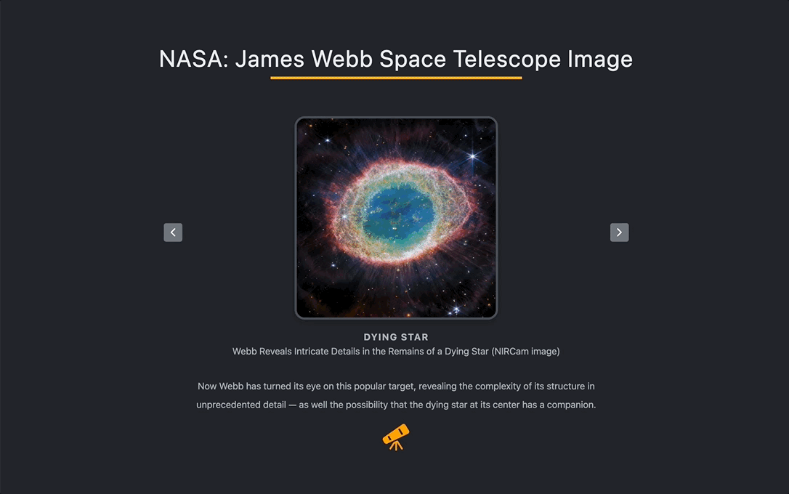

# Educational Image Slider for NASA

</div>

## Problem and Objective
Since its successful launch on December 25, 2021, attention towards the James Webb Telescope seems to be fading. Despite the efforts of Saffs and NASA to upload pictures and captivating content, valuable information about this hidden gem remains undiscovered by the public. Several issues have been identified:

- Lack of Centralized Control: Information and content about the telescope lack centralized management, leading to inefficiencies in dissemination.
- Scattered Images: Telescope-captured images are dispersed across multiple platforms, hindering user accessibility and appreciation.
- Unorganized Picture Presentation: The presentation of images lacks cohesion, resulting in a mix of unrelated visuals.
- Hidden Captivating Content: Despite its abundance, the telescope's captivating content remains undiscovered and underutilized, failing to showcase its full potential.

Addressing these issues would enhance the visibility, accessibility, and impact of the James Webb Telescope, allowing more people to appreciate its scientific achievements and inspiring wonder about the universe.


## Environment Set up `Step by Step Guide `

1. Create a new folder and install react-icons

```
npx create-react-app <file-name>
cd <file-name>>
npm install react-icons
```

2. Running npm start will render the React application with a confirmatory message on preferred browser.

```
npm start
```

3. Pruning and Defining components
Establishing a structured folder hierarchy and organizing files from the outset of a project can significantly contribute to maintaining a logical flow throughout development. 

```
project-root
├── src
│   ├── components
│   │   ├── Component1
│   │   │   ├── Component1.js
│   │   │   └── Component1.css
│   │   ├── Component2
│   │   │   ├── Component2.js
│   │   │   └── Component2.css
│   │   └── ...
│   ├── model
│   │   ├── data.js
│   │   └── ...
│   ├── App.js
│   ├── App.css
│   ├── index.js
│   └── index.css
├── public
│   ├── index.html
│   └── ...
├── node_modules
├── package.json
└── ...


```

3. Inside the data.js file, simply create the James Webb' Space Telescope Image array:

```
const james = [
  {
    id: 1,
    image:'http://'
    name: '...',
    title: '...',
    description:
      '...',
  },
  {...
  },
];

export default james;
```

## New Approach 

1. For CSS control, I utilized [CSS variables](https://developer.mozilla.org/en-US/docs/Web/CSS/Using_CSS_custom_properties).

2. Each logic was commented to provide clarity on the logical flow. I particularly emphasized the new learning about props and hooks.

3. I installed React-icons from [react-icons](https://react-icons.github.io/react-icons/) using the following command:
```
npm install react-icons
```

## Credit
## Credit
1. This project was bootstrapped with [Create React App](https://github.com/facebook/create-react-app).

2. Image and content credit: [JAMES WEBB SPACE TELESCOPE GODDARD SPACE FLIGHT CENTER](https://webb.nasa.gov/content/multimedia/images.html)

3. High-definition image credit: [James Webb Space Telescope](https://www.flickr.com/photos/nasawebbtelescope/)

4. Contents were rendered using [Grammarly](https://www.grammarly.com/) and [ChatGPT](https://openai.com/chatgpt/).
